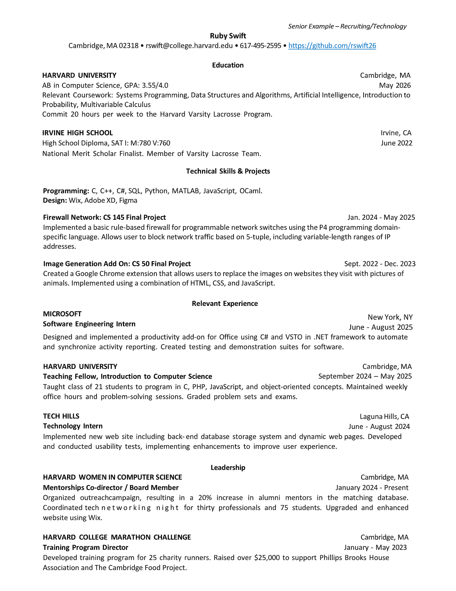
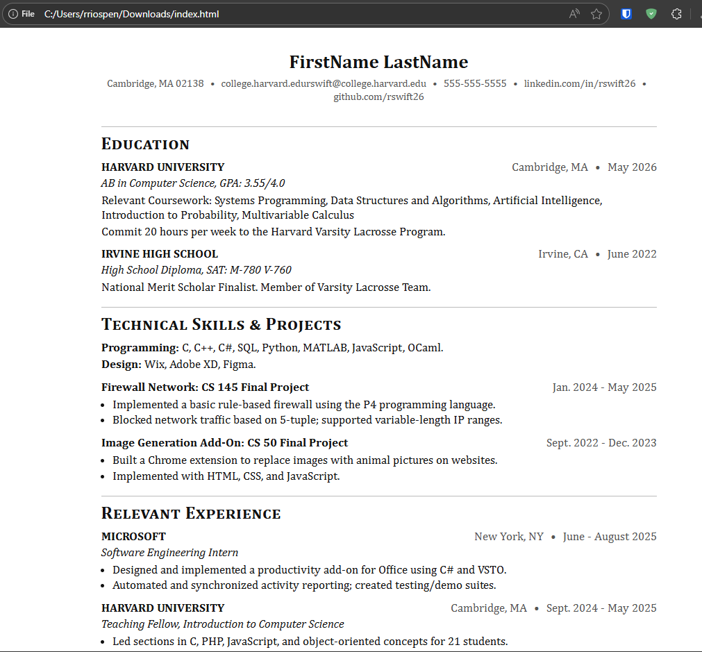

# Frontend Technical Specification

- Create a static webiste that serves an HTML resume.

## Resume Format Considerations

I live in the United States, so the resume should follow the US format, which typically includes:
- Contact Information: Name, phone number, email address, LinkedIn profile, and GitHub link.
- Summary or Objective: A brief statement summarizing career goals and key qualifications.
- Work Experience: List of previous jobs, including job title, company name, location, dates of employment, and bullet points describing responsibilities and achievements.
- Projects: Notable projects that demonstrate skills and experience, including links if applicable.
- Skills: A list of relevant technical and soft skills.
- Certifications: Any relevant certifications or professional development courses.
- Education: Degrees obtained, institutions attended, graduation dates, and any relevant honors or awards.
- Formatting: Use clear headings, bullet points, and consistent formatting to enhance readability.
- Length: Ideally one page, but can extend to two pages if necessary for more experienced candidates.
- Keywords: Include industry-specific keywords to pass through Applicant Tracking Systems (ATS).
- Design: Clean and professional design, avoiding excessive graphics or colors.
- Exclude Personal Information: Avoid including personal details such as age, marital status, or a photograph, things that can lead to discrimination or bias.

## Resume Format Generation

I'm going to use the [Harvard Resume Template](https://careerservices.fas.harvard.edu/resources/harvard-college-resume-example-tech/) as a base for the resume format. It is a clean and professional template that aligns well with the considerations mentioned above.

I know HTML and CSS well enough, so I'm going to let GenAI do the heavy lifting of generating the initial code for the resume based on the Harvard template.
I will then review and tweak the generated code to ensure it meets my specific needs and preferences.

Promt to ChatGPT 5:

```text
Convert this resume format into a static HTML and CSS code for a personal resume website.
Please don't use a CSS framework like Bootstrap; instead, write custom CSS to style the resume.
Please use the least amount of CSS tags necessary to achieve a clean and professional look similar to the Harvard Resume Template.
```

Image provided to LLM:



This is the [generated output](./docs/2025-12-04-resume-template.html) for the resume website which I will refactor.

This is what the generated HTML looks like unaltered:



## HTML Adjustments

- We'll extract our styles into its own stylesheet after we are happy with our HTML markup.
- We'll simplify some of the HTML structure to make it cleaner and easier to maintain.
- For the HTML page I'll use soft tabs two spaces for indentation.

## Serve Static Website Locally

We need to serve our static website locally so we can start using stylesheets externally from our HTML page in a Cloud Developer Environment (CDE).

> This is not nnecessary with local development.

Assuming we have node installed, we'll use the simple web-server http-server

## Install HTTP server

```sh
cd frontend
npm i -g http-server
```

## Serve Website

http-server will serve a public folder by default

```sh
http-server
```

## Image Size Considerations

I have a background JPG texture that was 818KB.
I'm going to optimize it to WEBP with an online tool.
Optimized image size is 216KB.